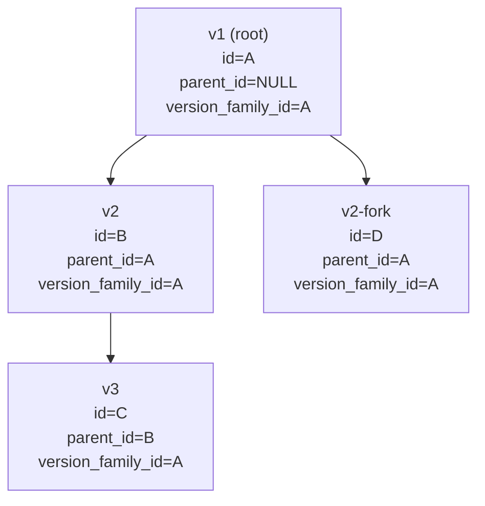

# PRD: Unified Version Family for Data Contracts and Data Products

## Problem Statement

Data Contracts and Data Products are versioned, but the version model is implemented inconsistently and only half-exposed in the UI.

1. **Two independent grouping mechanisms.** Both `data_contracts` and `data_products` carry a `parent_*_id` UUID and a `base_name` string. The version-listing query (`get_contract_versions` in `src/backend/src/controller/data_contracts_manager.py`) primarily groups by `base_name` (or worse, the mutable `name` column), and only falls back to `parent_*_id` when the string match returns empty.
2. **Inconsistent population.** The lightweight `create_new_version` path leaves both `base_name` and `parent_contract_id` `NULL` on the clone. The deep `ContractCloner` path sets `base_name` and `parent_contract_id` *and* mutates the clone's `name` to `<base>_v<version>`. The two paths leave the database in mutually incompatible states; from a clone's detail page the version family looks like a single-version family.
3. **Asymmetric UI.** Data Contracts have a version dropdown plus prev/next chevrons in the detail header. Data Products have a "New Version" button but no way to switch versions or even see siblings — and there is no `GET /api/data-products/{id}/versions` endpoint.
4. **No "latest" semantics in list views.** Both list views show every version as a separate row. Consumers see deprecated and draft rows mixed with the active ones, with no role-aware "show the version that applies to me" rule.
5. **Selectors elsewhere can't disambiguate or follow-latest.** When linking a contract to an output port, picking a product for an MDM source, etc., the dropdown shows a flat list of all versions with no scope choice. GitHub issue [#69](https://github.com/databrickslabs/ontos/issues/69) reports this concretely: same-named contracts appear identically in dropdowns. Today there is no way to express either "pin to v1.2.0" or "always follow the latest published version of this family."

Net effect: a user who clones a contract and tries to switch between versions on the detail page sees a single-version selector (it hides itself when only one row is returned), and a user picking a contract in any dropdown elsewhere in the app cannot tell duplicates apart.

## Solution

Introduce one canonical, immutable grouping key per entity — `version_family_id` (UUID) — populated consistently from every clone path. Use it as the primary lookup for "all versions of this family," with `parent_*_id` retained to encode lineage and forks.

Expose unified version-listing endpoints for both entities, ship a shared `VersionSelector` + `VersionNavigator` used on both detail views, and collapse the main list views to one row per family showing the version that is appropriate for the current user (consumer / subscriber / team member / owner / admin).

In every place where a contract or product is selected (output port linkage, MDM source, etc.), replace the ad-hoc dropdown with a unified `EntityVersionPicker` that supports two **scopes**: pin to a specific entity version, or follow the family's latest visible version. This subsumes [#69](https://github.com/databrickslabs/ontos/issues/69).

## User Stories

1. As a Data Producer, when I clone a Data Contract or Data Product to create a new version, I want the version selector and prev/next chevrons to appear on the detail page so I can switch between versions of the same family.
2. As a Data Producer, when I clone, I want the clone to inherit a stable family identifier so that the linkage is preserved regardless of renames or future status changes.
3. As a Data Consumer browsing the main Data Products list, I want to see one row per family with the latest **active** version, so I don't have to mentally filter draft and deprecated rows.
4. As a Data Consumer who is subscribed to a Data Product, I want to additionally see upcoming draft/proposed versions of that product in the list, so I can preview changes that will affect my subscription.
5. As a team member or owner, I want the list view to also surface versions I am working on (drafts, proposed) for entities I co-own, so I can find my in-flight work without enabling "show all versions."
6. As any user, I want a "Show all versions" toggle on the list view so I can audit the full version history when I need to.
7. As a Data Producer building an output port, when I pick the contract this port implements, I want to choose either a specific version (pin) or the family's latest published version (follow-latest), so I can decide whether the port auto-tracks contract updates.
8. As a Data Producer linking a Data Product to a Data Contract, I want the dropdown to show the version alongside the name, so I can tell same-named contracts apart (resolves [#69](https://github.com/databrickslabs/ontos/issues/69)).
9. As a Data Consumer, when I am viewing a specific version of a contract or product, I want to see how many other versions exist in the family and have one-click navigation to the latest, previous, or next.
10. As an Admin, I want every version of an entity to share the same immutable `version_family_id` regardless of whether the deep cloner or the lightweight version-create path was used, so I can rely on a single grouping key in queries, exports, and downstream integrations.
11. As an Admin, I want the cloner to stop mutating the `name` of new versions (no more `<base>_v<version>` suffix), so the human-readable name remains stable across the family.
12. As a Subscriber, I want my subscription to be expressible at the family level so that I automatically receive notifications for new versions in the family, not just the specific version I originally subscribed to.
13. As a Data Steward, when I look at a list of contracts linked to an output port that uses "follow latest," I want the UI to show the currently-resolved version with an indicator that it's a family reference, so I can tell pinned and follow-latest links apart.

## Implementation Decisions

### Grouping key: `version_family_id`

- New nullable UUID column added to `data_contracts` and `data_products`, indexed. After backfill it becomes `NOT NULL`.
- For every row: `version_family_id = root.id` where `root` is the family root reached by walking `parent_*_id` upward. For roots, `version_family_id = self.id`.
- `parent_*_id` is retained as the lineage primitive (it allows forks: two siblings can share a parent). `version_family_id` is the denormalized set-membership tag — copied from parent on every clone.
- `base_name` column is kept (nullable) but no longer queried. Removal deferred to a follow-up.



### Backfill (one Alembic migration per table or one combined)

- Pass 1: rows with `parent_*_id IS NULL` get `version_family_id = id`.
- Pass 2: load all remaining rows, walk parent links to the root via an in-memory parent map (single Python pass; no recursive SQL needed for our row counts), and assign the root's id.
- Pass 3: sanity check (every row non-null), then `ALTER COLUMN ... SET NOT NULL`.
- Downgrade drops the column.

### Clone-path consistency

- `DataContractsManager.create_new_version` (`src/backend/src/controller/data_contracts_manager.py`) — sets `version_family_id = original.version_family_id` and `parent_contract_id = original.id`. Currently sets neither.
- `ContractCloner` (`src/backend/src/utils/contract_cloner.py`) — sets `version_family_id = source.version_family_id`. Also stops rewriting `name` to `<base>_v<version>` — `name` stays equal to the source's `name`.
- `DataProductsManager` version-create (line ~1434) and personal-draft commit (line ~1532) — both set `version_family_id = source.version_family_id`.
- Initial create (no parent): repositories set `version_family_id = obj.id` once the id is generated.

### Visibility rules for "which version is the user's version"

Status priority is computed per user role:

- **Consumers (no subscription, no team membership):** rank = `ACTIVE > DEPRECATED`. Other statuses are filtered out.
- **Subscribers** of any version in the family: rank = `DRAFT > PROPOSED > UNDER_REVIEW > APPROVED > ACTIVE > DEPRECATED`. (Drafts and in-flight versions surface first so subscribers preview upcoming changes.)
- **Team members / owners / admins:** rank = `DRAFT > PROPOSED > UNDER_REVIEW > APPROVED > ACTIVE > DEPRECATED`, including their own personal drafts (`draft_owner_id` matching the current user).
- Personal drafts (`draft_owner_id IS NOT NULL`) are visible only to their owner regardless of role.

These are encoded in a `<visibility_rank>` SQL expression used by:

```sql
SELECT * FROM (
  SELECT *, ROW_NUMBER() OVER (
    PARTITION BY version_family_id
    ORDER BY <visibility_rank>, version DESC, created_at DESC
  ) AS rn
  FROM data_contracts
  WHERE <visibility_filter>
) WHERE rn = 1
```

`<visibility_filter>` excludes statuses the user shouldn't see at all (`RETIRED` for non-admins, personal drafts not belonging to them, etc.). `ROW_NUMBER()` is supported on both Postgres and Databricks SQL.

### Backend endpoints

- `GET /api/data-contracts/{id}/versions` — rewritten to use `version_family_id` lookup with visibility filter (current implementation in `src/backend/src/routes/data_contracts_routes.py` line ~3553).
- `GET /api/data-products/{id}/versions` — new. Returns `[{id, name, version, status, versionFamilyId, parentProductId, changeSummary, createdAt, draftOwnerId}]`.
- `GET /api/data-contracts` and `GET /api/data-products` — list endpoints call `list_family_representatives` by default (one row per family). New query param `?include_history=true` flattens to all versions.
- `GET /api/data-{contracts,products}/families/{family_id}/latest` — convenience resolver used by family-scope references (see below).

### Frontend: shared components

- `src/frontend/src/components/common/version-selector.tsx` — generalized over `entityKind`. Replaces the contract-specific `src/frontend/src/components/data-contracts/version-selector.tsx`. Returns `null` when only one visible version exists.
- `src/frontend/src/components/common/version-navigator.tsx` — bundles prev/next chevrons + selector. Drop-in for both detail views.
- Wired into `data-contract-details.tsx` (replaces lines ~1688–1717) and `data-product-details.tsx` (added near the "Back to List" button).

### Frontend: list view changes

- Default fetch: server returns one row per family (latest visible version).
- Header toggle "Show all versions" → `?include_history=true`.
- "Versions" column showing `<current> / <total in family>` (e.g. `v2.1.0 / 3`). Small chevron expands a sub-row listing other visible versions, each clickable to navigate.
- Same UX on Data Products and Data Contracts list views.

### Unified entity picker (subsumes #69)

A single `<EntityVersionPicker>` component at `src/frontend/src/components/common/entity-version-picker.tsx` replaces every place where a contract or product is currently chosen via an ad-hoc dropdown. Two scopes:

- **Entity-pinned** — reference is `(entity_kind, entity_id)`. Stable; does not follow future version bumps. Default for backward compatibility.
- **Family-follow-latest** — reference is `(entity_kind, version_family_id)`. Resolves to the latest visible version at read time via `list_family_representatives` rules.

Component shape:

```tsx
type EntityKind = 'data-contracts' | 'data-products'
type ScopeValue =
  | { scope: 'entity'; entityKind: EntityKind; entityId: string; displayVersion?: string }
  | { scope: 'family'; entityKind: EntityKind; familyId: string; familyName?: string }

type EntityVersionPickerProps = {
  entityKind: EntityKind
  value: ScopeValue | null
  onChange: (next: ScopeValue) => void
  allowedScopes?: ('entity' | 'family')[]
  filter?: { domainId?: string; status?: string[] }
}
```

UI behavior:

- Combobox shows one row per family by default (label includes the resolved current version), with a scope toggle (Entity ▾ vs Latest ▾).
- In Entity mode, an inline version sub-picker (reusing `<VersionSelector>`) lets the user pin a specific version.
- A small badge/icon distinguishes "follow latest" references in any downstream display (e.g. on output port cards, in MDM source lists) — so users can tell pinned and follow-latest links apart at a glance.

Migration call sites (initial pass):

- `src/frontend/src/components/data-products/link-contract-to-port-dialog.tsx` — resolves #69.
- `src/frontend/src/components/data-contracts/link-product-to-contract-dialog.tsx`
- `src/frontend/src/components/data-products/output-port-form-dialog.tsx`
- `src/frontend/src/components/data-products/create-from-contract-dialog.tsx`
- `src/frontend/src/components/mdm/link-source-dialog.tsx`
- `src/frontend/src/components/mdm/mdm-config-dialog.tsx`

### Reference storage (entity vs family)

For relationships that should allow "follow latest," the linking table is extended with a nullable family column alongside the existing entity FK:

- Example: output port → contract becomes `(contract_id NULLABLE, contract_family_id NULLABLE)` with a CHECK constraint that exactly one is set. Read paths use a `resolve_target(db, entity_id, family_id, user)` helper that returns the pinned entity row or the family's "latest visible" row.
- Initial scope: output port → contract, MDM source link → product/contract. Other reference tables added on demand; not every link needs to support follow-latest.
- Existing rows are migrated as entity-pinned (no behavior change).

## Testing Decisions

### What makes a good test

Tests verify externally observable behavior through public interfaces — endpoint behavior, query results, and resolved references — rather than internal wiring. Migration tests verify post-state invariants on representative DB fixtures.

### Modules to test

- **Migration backfill**: synthetic fixture with roots, chains, forks, and orphans → every row has a non-null `version_family_id` matching its root.
- **Clone paths**: `create_new_version`, `ContractCloner`, `DataProductsManager.create_version`, personal-draft commit — clones inherit `version_family_id` from source and set `parent_*_id = source.id`.
- **`get_family_versions`**: returns full family list; visibility filter hides personal drafts of other users.
- **`list_family_representatives`**: one row per family for consumer/subscriber/owner roles; subscriber sees draft when present; admin sees retired only when admin flag set.
- **List endpoints**: default and `?include_history=true` shapes.
- **`resolve_target` helper**: returns the right row for entity-pinned and family-follow-latest references; family resolution honors visibility rules.
- **Cloner name behavior**: new clones keep `name` unchanged (regression test for the dropped `_v` suffix).
- **`EntityVersionPicker` component**: scope toggle, entity sub-picker, allowedScopes filtering; pickers in linked dialogs persist the right `ScopeValue` shape.

### Prior art

- Existing version-listing tests in `test_data_contracts_routes.py` (extend for visibility).
- `test_contract_cloner.py` if present, otherwise create.
- Frontend Vitest tests for the contract-only `version-selector.tsx` — port to the shared component.

## Out of Scope

- **Removing the `base_name` column and `_extract_base_name` heuristic.** Deferred to a follow-up after we're confident nothing reads them.
- **Rich version-tree visualization.** The existing `version-history-panel.tsx` continues to use `parent_*_id` for tree display; that is the right primitive for that view.
- **Applying the family pattern to other versioned entities** (ontology concepts, compliance policies, glossary terms). Not required by current scope.
- **Automatic migration of existing clones whose names have the `_v<version>` suffix.** They keep their suffixed names; only future clones get the unchanged name.
- **Cross-family merges / promote-fork-to-mainline workflows.** Forks remain part of the same family by design; explicit re-parenting tooling is a separate concern.

## Further Notes

### Relationship to existing features

- **Subscriptions** (`entity_subscriptions` table): a future enhancement is to allow family-scoped subscriptions (`entity_id` replaced by `version_family_id`); not part of this PRD but unblocked by it.
- **Compliance checks** that operate on contracts/products: when run against a family-scoped reference, they should check the resolved current version.
- **Marketplace / publication scope**: family-follow-latest is the natural shape for marketplace listings — consumers see the published latest of each family.

### Migration path

- Backfill is non-breaking: existing entities continue to work, the list view starts collapsing by family the moment the endpoint switch lands.
- The cloner `name` change affects only new clones; existing rows are untouched.
- Reference-storage changes are opt-in per linking table; existing rows continue to be entity-pinned.

### Open questions

- Should family-scoped subscriptions ship in this PRD or as a follow-up? (Recommendation: follow-up; it depends on this work but isn't required by it.)
- For the "Versions" column in the list view, do we want a column or a badge inline with the version? (Recommendation: a small `vN.N.N / count` badge next to the version, with chevron-to-expand.)
- For the unified picker, do we need a third scope ("any version in family — let me pick later") for placeholder linkage during draft authoring? (Recommendation: no — use entity-pinned with a clear "draft" indicator instead.)

### Linked issues

- Subsumes [#69](https://github.com/databrickslabs/ontos/issues/69) "[Feature]: UI support for contract versions" — the unified picker disambiguates same-named contracts and adds the option to follow latest.
